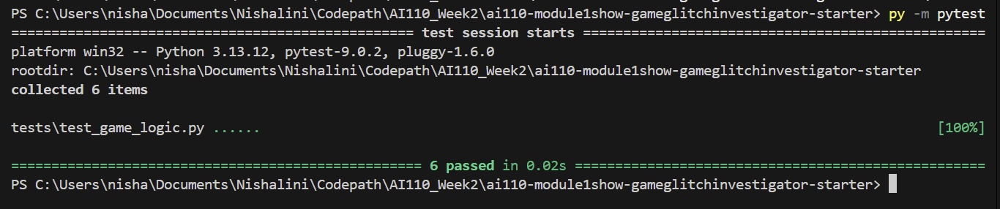
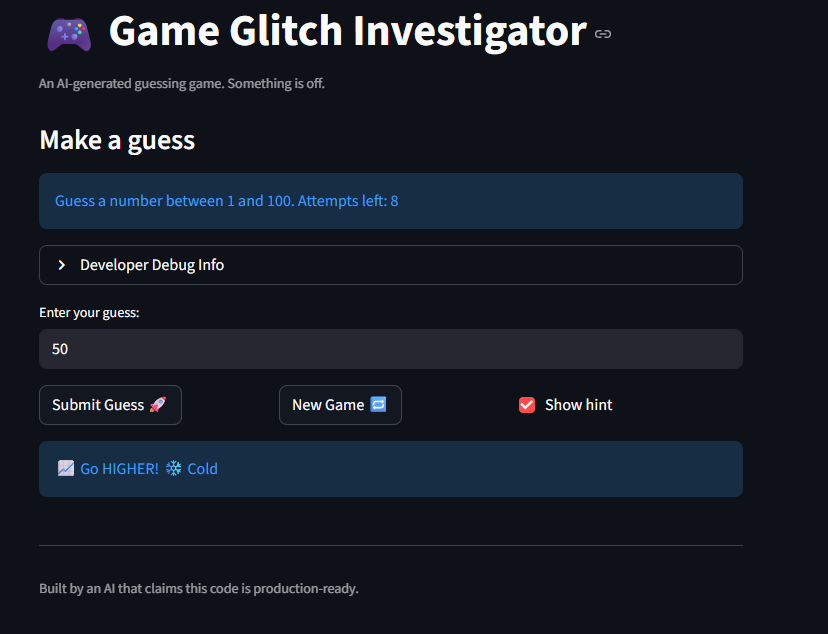
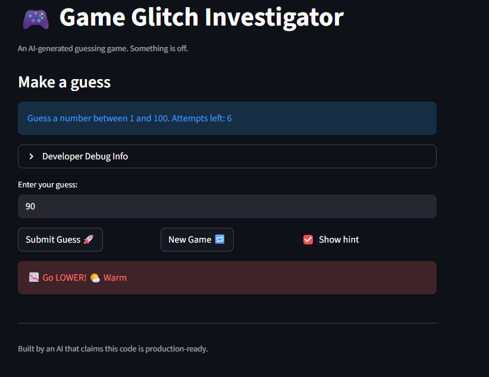

# 🎮 Game Glitch Investigator: The Impossible Guesser

## 🚨 The Situation

You asked an AI to build a simple "Number Guessing Game" using Streamlit.
It wrote the code, ran away, and now the game is unplayable. 

- You can't win.
- The hints lie to you.
- The secret number seems to have commitment issues.

## 🛠️ Setup

1. Install dependencies: `pip install -r requirements.txt`
2. Run the broken app: `python -m streamlit run app.py`

## 🕵️‍♂️ Your Mission

1. **Play the game.** Open the "Developer Debug Info" tab in the app to see the secret number. Try to win.
2. **Find the State Bug.** Why does the secret number change every time you click "Submit"? Ask ChatGPT: *"How do I keep a variable from resetting in Streamlit when I click a button?"*
3. **Fix the Logic.** The hints ("Higher/Lower") are wrong. Fix them.
4. **Refactor & Test.** - Move the logic into `logic_utils.py`.
   - Run `pytest` in your terminal.
   - Keep fixing until all tests pass!

## 📝 Document Your Experience

- [X] Describe the game's purpose.
- [X] Detail which bugs you found.
- [X] Explain what fixes you applied.

The purpose of this game is for the user to guess a randomly generated number with limited attempts. There is an Easy, Normal, and Difficult Mode. The user is given hints such as "GO HIGHER" or "GO LOWER" after each guess. 

Bug's that were found:

In app.py
- hot_cold_label - I added this function to show the user if they are hot/cold as apart of Challenege 4. 
- closeness_emoji - I added this function to show the how close the user if to the actual guess as apart of Challenge 2.
- "secret" not in st.session_state - The game doesn't reset when changing difficulty. I added a check to reset the game when the difficulty changes.
- if "attempts" not in st.session_state:The attempts number was weird and one off. 
- st.sidebar.subheader("Guess History") - I added this as apart of Challenge 2.
- st.info(f"Guess a number between {low} and {high}.) " - The range isn't always 1 to 100 for each difficulty. Change it to low to high.
- raw_guess = st.text_input("Enter your guess:",key="guess_input") - Switching Difficulty doesn't reset the game. Add a new game button to reset the game when changing difficulty.
- if new_game: - Change the range from low to high instead of hardcoding it to 1 to 100. I also added a playing status check to prevent playing after winning or losing until a new game is started.
- if submit: - Take out the increment of attempts from the top and put it here so that it only increments when a guess is submitted. 

In test_game_logic.py
- I added test_guess_negative_number, test_guess_large_number, and test_guess_boundary_value as apart of Challenge 1
- I added asserts "LOWER" or "HIGHER" to test_guess_too_high and test_guess_too_low

In logic_utils.py
- I added professional-grade docstrings to every function in logic_utils.py as apart of Challenge 3.
- get_range_for_difficulty - The hard difficulty is actually easier than normal because the range is smaller.Changed to 200 to make it harder.
- check_guess - The logic for Too High and Too Low is reversed. If the guess is greater than the secret, it should be "Too Low" and vice versa.
- update_score - The scoring system is a bit weird. Winning on the first attempt gives 90 points, but winning on the second attempt gives 80 points, and so on. I changed it to give more points for earlier wins and a minimum of 10 points for winning.

## 📸 Demo

- [X] [Insert a screenshot of your fixed, winning game here]

## 🚀 Stretch Features

- [X] [If you choose to complete Challenge 4, insert a screenshot of your Enhanced Game UI here]

I added Hot/Cold States as the Enanced Game UI feature for Challenge 4. 

Reflect and Discuss

The core concepts the students need to understand is how to use AI effectively to fix and find bugs within the code. The student might have some issues running the code. I had to use run streamlist run app.py instead of python -m streamlit run app.py. And I also had to use py -m pytest to run the tests instead of just pytest. Those were the main problems I ran into. Otherwise, I think the lab is straightforward in terms of using the AI to find problems in the code. I think the AI was helpful in fixing specific bugs that were specific to the function. I believe the AI is misleading if you ask it to vaguely do something like add a feature without giving it details or specifications. I would ask the students to first run the app by themselves, find specific bugs, go back into the code, and analyze it before asking AI for help. So this will help the student learn without getting the answer.

